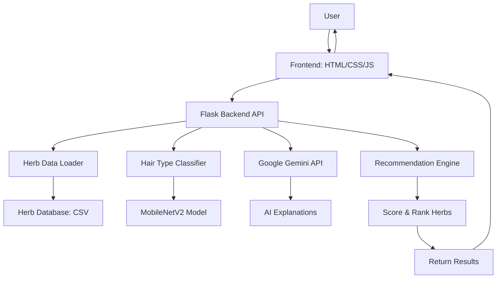
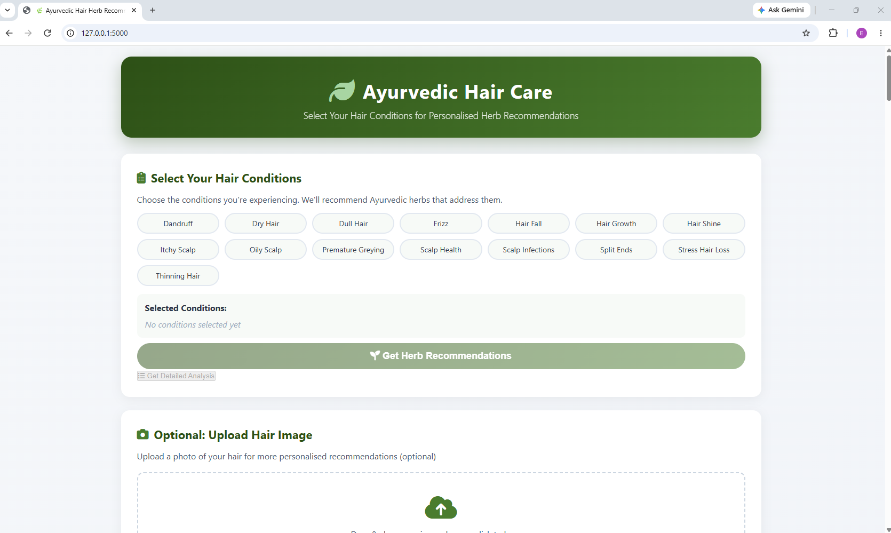
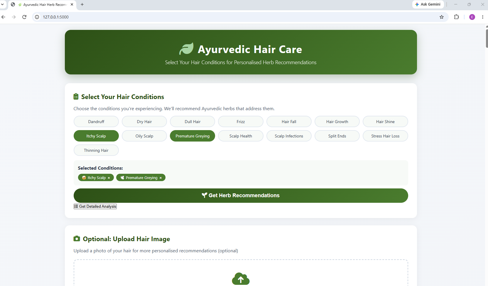
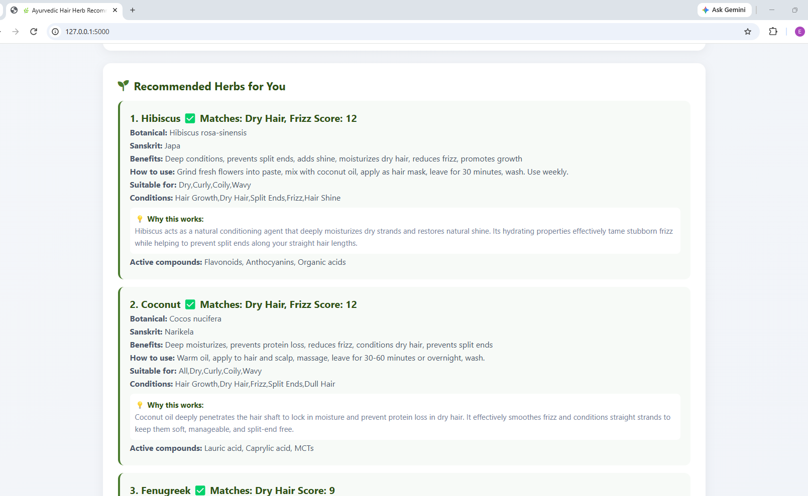

# 🌿 Ayurvedic Hair Herb Recommender

An AI-powered web application that recommends Ayurvedic herbs for natural hair care based on your hair conditions and optional image analysis.

[](https://www.python.org/)
[](https://flask.palletsprojects.com/)
[](https://ai.google.dev/)
[](LICENSE)

---

## 📋 Table of Contents

- [Overview](#-overview)
- [Key Features](#-key-features)
- [Demo](#-demo)
- [Technology Stack](#-technology-stack)
- [Project Architecture](#-project-architecture)
- [Quick Start](#-quick-start)
- [How It Works](#-how-it-works)
- [API Endpoints](#-api-endpoints)
- [Project Structure](#-project-structure)
- [Screenshots](#-screenshots)
- [Learning Outcomes](#-learning-outcomes)
- [Future Enhancements](#-future-enhancements)
- [License](#-license)
- [Acknowledgments](#-acknowledgments)

---

## 🌟 Overview

The **Ayurvedic Hair Herb Recommender** combines traditional Ayurvedic wisdom with modern AI to provide personalized herb recommendations for hair care. Users can select hair conditions, optionally upload a photo and receive AI-powered herbal recommendations with detailed explanations.


### What Makes This Project Special

- **🧠 AI-Powered**: Uses Google Gemini to generate personalized, natural language explanations
- **📸 Optional Image Analysis**: Upload a photo for AI-based hair type detection (Straight, Wavy, Curly, Coily)
- **📚 Comprehensive Database**: 60+ carefully curated Ayurvedic herbs with benefits and usage
- **🎯 Condition Matching**: Smart scoring system finds the best herbs for your specific needs
- **💬 AI Explanations**: Each recommendation comes with a detailed explanation of why it works
- **🔄 Resilient Design**: Fallback system ensures the app works even when APIs are unavailable

---

## ✨ Key Features

### Core Features

| Feature | Description | Status |
|---------|-------------|--------|
| **Condition-Based Recommendations** | Select hair conditions → Get targeted herb suggestions | ✅ Live |
| **Optional Image Classification** | Upload photo → AI predicts your hair type | ✅ Live |
| **AI-Powered Explanations** | Google Gemini generates personalized herb explanations | ✅ Live |
| **Comprehensive Herb Database** | 60+ hair-specific herbs with benefits and usage | ✅ Live |
| **Interactive Dashboard** | Clean, responsive UI with condition chips and results | ✅ Live |
| **Smart Fallback System** | Works even when AI APIs are unavailable | ✅ Live |
| **Search Functionality** | Find herbs by name, benefit, or condition | ✅ Live |

### Advanced Features

- **Multi-condition matching**: Herbs scored based on how well they address selected conditions
- **Evidence-based**: Herbs include evidence levels (High/Medium/Low)
- **Image Preprocessing**: Automatic image optimization for AI analysis
- **Confidence Scoring**: AI predictions include confidence percentages
- **Dynamic AI Prompts**: Gemini prompts are optimized for Ayurvedic expertise

---

## 🎥 Demo

### User Journey
1. Select Conditions → [🌱 Hair Growth] [💧 Hair Fall]

2. (Optional) Upload Image → AI detects "Curly hair (94% confidence)"

3. Click "Get Herb Recommendations"

4. AI analyzes → Finds matching herbs → Generates explanations

5. Results: Top herbs with benefits, usage, and AI explanations


### Sample Output

```json
{
  "herb_name": "Bhringraj",
  "benefits": "Promotes hair growth, prevents greying, strengthens roots",
  "how_to_use": "Apply Bhringraj oil to scalp, leave for 30-60 minutes",
  "ai_explanation": "Bhringraj is excellent for curly hair as it deeply nourishes the scalp and strengthens hair follicles. Its active compounds, wedelolactone and flavonoids, help reduce hair fall and promote new growth.",
  "match_score": 8
}
```

## 🛠 Technology Stack

### Backend

| Backend Layer | Version | Purpose |
| :---: | :---: | :---: |
| **Python** | 3.8+ | Core programming language |
| **Flask** | 2.3.2 | Web framework |
|**Flask-CORS** | 4.0.0 | Cross-origin resource sharing |
| **Pandas** | 2.0.3 | Data Manipulation |
| **PyTorch** | 2.0.1 | Deep learning for image classification |
| **TorchVision** | 0.15.2 | Image processing |
| **Pillow** | 10.0.0 | Image handling |
| **Python-dotenv** | 1.0.0 | Environment varibles |


### AI & Machine Learning

|Technology | Purpose |
| :---: | :---: |
| **Google Gemini API** | Natural language generation for herb explanations |
| **MobileNetV2** | Transfer learning for hair type classification |
| **Hugging Face API** | Fallback AI text generation |


### Frontend

| Technology | Purpose|
| :---: | :---: |
| **HTML5** | Structure |
| **CSS3** | Styling with custom design |
| **JavaScript(ES6+)** | Interactivity and API calls |
| **Font Awesome** | Icons |


## 🏡 Project Architecture


### Data Flow

1. User Input: Select conditions (and optionally upload an image)

2. Backend Processing:
    - Image → AI Classification → Hair Type (if uploaded)
    - Conditions → Database Query → Herb Matches

3. AI Enhancement: Google Gemini generates personalized explanations

4. Scoring: Herbs scored by condition match strength

5. Response: Combined results sent to frontend

6. Display: Results rendered in interactive dashboard


## 🚀 Quick Start
### Prerequisites
```
Python 3.8 or higher
Git (optional)
Google AI Studio API Key (free)
```

### Installation

```bash
# 1. Clone the repository
git clone https://github.com/lizkodjo/HairbalHair_Analysis.git
cd HairbalHair_Analysis

# 2. Create virtual environment
python -m venv venv
source venv/bin/activate  # On Windows: venv\Scripts\activate

# 3. Install dependencies
cd backend
pip install -r requirements.txt

# 4. Set up environment variables
# Create a .env file in the backend directory
echo "GOOGLE_AI_STUDIO_KEY=your_gemini_api_key_here" > .env
# Get your key at: https://aistudio.google.com/app/apikey

# 5. Run the application
python app.py
```

### Usage
1. **Open browser**: http://localhost:5000

2. **Select conditions**: Click condition chips (e.g., Hair Growth, Dandruff)

3. **Optional**: Upload a hair image for AI analysis

4. **Click**: "Get Herb Recommendations" or "Detailed Analysis"

5. **View**: Personalized herb recommendations with AI explanations

## 🔬 How It Works

### User Flow

```Select Conditions → (Optional: Upload Image) → Get Recommendations → View AI Explanations```

### Recommendation Engine
```User Input → Match Conditions → Score Herbs → Rank Results → AI Explanations```

### AI Integration
```Prompt → Google Gemini → Personalized Explanation```

## 🔌 API Endpoints

| Endpoint | Purpose |
| :--- | :--- |
| `GET /api/health ` | Check system status |
| `GET /api/conditions ` | List all har conditions |
| `GET /api/herbs` | Get all herbs |
| `POST /api/recommend ` | Get recommendations (no image)|
| `POST /api/predict` | Get recommendations (with image) |


## 📁 Project Structure

```text
HairbalHair_Analysis/
├── backend/
│   ├── config.py 
│   ├── app.py                      # Main Flask application
│   ├── requirements.txt            # Python dependencies
│   ├── .env                        # Environment variables
│   ├── api/
│   │   ├── gemini_simple.py        # Google Gemini integration
│   │   └── huggingface_integration.py  # Hugging Face fallback
│   ├── routes/
│   |    └── api_routes.py           # API routes
│   ├── data/
│   │   └── hair_herbs_comprehensive.csv  # 60+ hair herbs
│   ├── database/
|   |   └── herb_repository.py      # Herbs file
│   ├── model/
│   │   └── hair_classifier.py      # Optional image classifier
|   ├── services/
|   |   ├── ai_service.py           # AI Services
|   |   ├── classifier_service.py   # Hair classifier
|   |   └── recommendation_service.py   # Recommendations
|
├── frontend/
│   ├── index.html                  # Main HTML page
│   ├── style.css                   # Custom styles
│   └── script.js                   # Frontend logic
└── README.md                       # This file

```

## 📷 Screenshots
### Dashboard



### With Image


### Options


### AI generated response


### Recommended herbs



## 🎓 Learning Outcomes
### PCAD

| Skill | Implementation |
| :--- | :---|
| **Data Structures** | Pandas DataFrames, lists, dictionaries |
| **Daata Processing** | ETL pipeline, CSV reading/writing |
| **Data Analysis** | Statistical analysis, data profiling |
| **Data Visualisation** | Confidence bar charts, table displays |
| **API Integration** | REST APIs, JSON handling |

### GAIL (Google AI Learning)

| Skill | Implementation |
| :--- | :--- |
| **Transfer Learning** | MobileNetV2 for image classification |
| **Prompt Engineering** | Optimised prompts for Gemini API |
| **Computer Vision** | Image preprocessing, feature extraction |
| **Natural Language Processing** | AI-generated herb explanations |
| **Ethical AI** | Transparent, educational responses |
| **API Integration** | Google Gemini API integration |

### Full Stack Development

| Skill | Implementation |
| :--- | :--- |
| **Backend** | Flask API, routing, middleware |
| **Frontend** | HTML5, CSS3, JavaScript, DOM manipulation |
| **Database** | CSV data modelling, query optimisation |
| **API Design** | RESTful endpoints, JSON responses |

## 🚀 Future Enhancements
### Short Term (Next 3 months)
- **User Authentication**: Save profiles and history
- **Favourites System**: Save favourite herbs
- **PDF Export**: Generate printable reports
- **Email Reminders**: Herb usage reminders

### Medium Term (3-6 months)
- **Mobile App**: React Native
- **More herbs**: Expand to 100+ herbs
- **Product Links**: Connect to herbal product stores
- **User Reviews**: Community ratings and reviews

### Long Term (6+ months)
- **Custom Model Training**: Train on hair-specific datatset
- **Real-time Consultation**: AI-powered hair care consultation
- **Progress Tracking**: Track hair improvement over time
- **Multi-language Support**: Support mutliple languages


## 📄 License
MIT License - See [LICENSE](LICENSE) for details

## 🤝 Acknowledgments
### Data Sources 
- [Amidha Ayurveda](https://www.amidhaayurveda.com/p/home.html) - Primary herb database
- Traditional Ayurvedic texts for herb properties

### AI & APIs
- [Google AI Studio](https://aistudio.google.com) - AI text generation
- [Hugging Face](https://huggingface.co/) - Fallback AI models
- [PyTorch](https://pytorch.org/) - Deep learning library

### Inspiration
- Traditional Ayurvedic medicine
- Modern hair research
- Open-source AI community

### Special Thanks
- PCAD and GAIL certification programs
- Mentors and instructors
- Open-source contributors

## 📞 Contact
### Liz Kodjo
-   📧 [Email](ellizakodjo@outlook.com])
- 🔗 [LinkedIn](https://www.linkedin.com/in/elizabeth-kodjo)
- 💼 [GitHub](https://github.com/LizKodjo)
